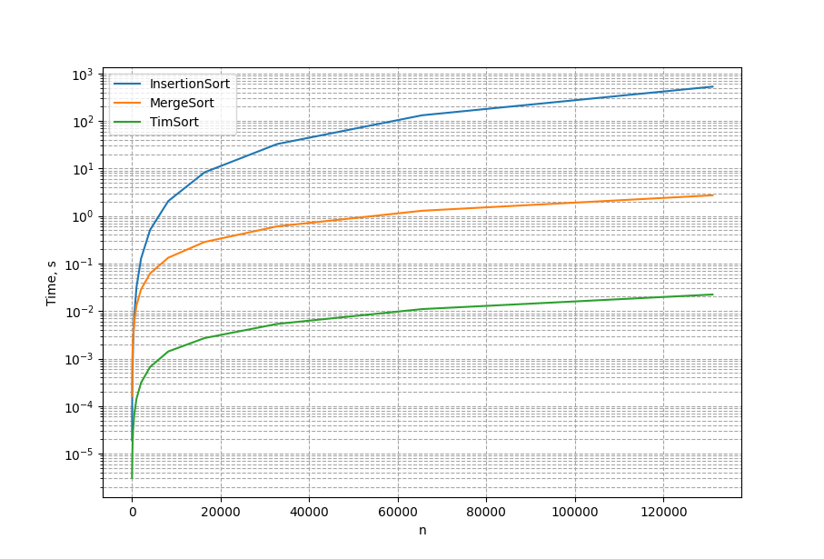

# Sort algorithms speed comparison 

## Methodology
Three sorting algorithms were used for comparison: merge sort, Timsort, and insertion sort.

Random lists of integers were generated for this comparison. The lists ranged in length from 2^4 to 2^18 with a step of 2^n+1. Each generated list was stored in a dictionary to reduce the need for regenerating random lists for each sorting algorithm.

Execution time was measured by calculating the difference between `time.time()` before and after the sorting execution, also `timeit` was used in final calculations and show significant difference.

Lists with execution times were created for each sorting algorithm using list comprehension.

Plots were generated using the execution time lists, illustrating the time differences in sorting execution.

## Results 

Graph shows that Insertion Sort algorithm is much slower that Merge Sort and Timsort.  
 

Using log scale helps to determinate that Python build-in Timsort algorithm is the quickest. 

According to this research 
* Python already has the quickest build-in sort algorithm (Timsort).
* Custom sort algorithm realisations are slower and can add unpredicted complications.